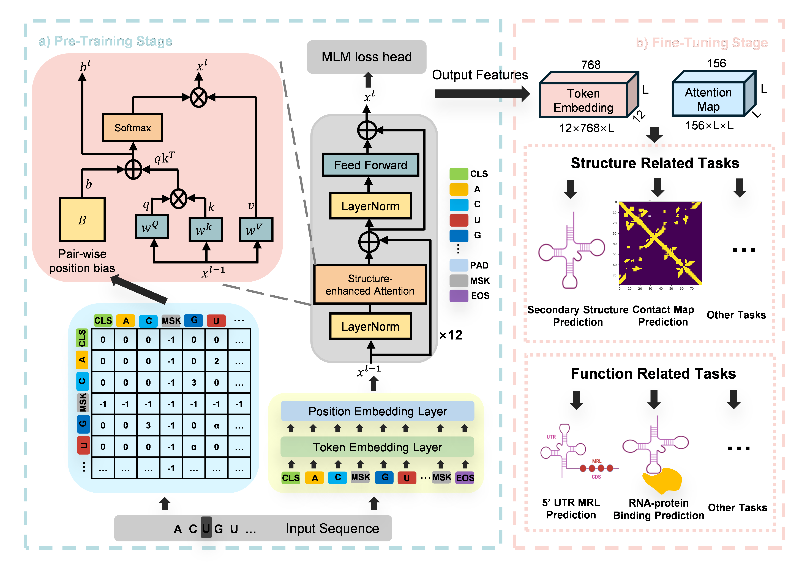

# ERNIE-RNA
This repository contains codes and pre-trained models for **RNA feature extraction and secondary structure prediction model (ERNIE-RNA)**.  
**ERNIE-RNA is superior to the tested RNA feature extraction models (including RNA-FM) in the feature extraction task, and its effect in the secondary structure prediction task is better than RNAfold, UNI-RNA and others.**
You can find more details about **ERNIE-RNA** in our paper, [ERNIE-RNA: An RNA Language Model with Structure-enhanced Representations](https://www.biorxiv.org/content/10.1101/2024.03.17.585376v1)




</details>

<details><summary>Table of contents</summary>
  
- [Setup Environment](#Setup_Environment)
- [Pre-trained Models](#Available_Pretrained_Models)
- [Usage](#usage)
  - [ERNIE-RNA Embedding Generation](#ERNIE-RNA_Embedding_Generation)
  - [RNA Secondary Structure Prediction](#ERNIE-RNA_Structure_Prediction)
- [Citations](#citations)
- [License](#license)
</details>

## Create Environment with Conda <a name="Setup_Environment"></a>
First, download the repository and create the environment.
```
git clone https://github.com/Bruce-ywj/ERNIE-RNA.git
cd ./ERNIE-RNA
conda env create -f environment.yml
```
Then, activate the "ERNIE-RNA" environment.
```
conda activate ERNIE-RNA
```

## Access pre-trained models. <a name="Available_Pretrained_Models"></a>
There are two subfolders in the model folder, each folder has a link, and you can download the model in the link to the same directory. Or you can download both models from our [drive](https://drive.google.com/drive/folders/1guWzYKJ2auh4FMFzxEWEnANJh91uhVZE)

## Apply ERNIE-RNA with Existing Scripts. <a name="Usage"></a>
### 1. Embedding Extraction. <a name="ERNIE-RNA_Embedding_Generation"></a>
```
python extract_embedding.py --seqs_path='./data/test_seqs.txt' --device='cuda:0'
```

The model path parameters are set by default and do not need to be changed.

The corresponding feature extraction code is inside this file, and the sequence in the file can be modified when used.

In this file, you can use ERNIE-RNA (twod_mlm) for feature extraction.

Features include cls, tokens, atten_map.

### 2. Secondary structure prediction. <a name="ERNIE-RNA_Structure_Prediction"></a>
```
python predict_ss_rna.py  --seqs_path='./data/test_seqs.fasta' --device='cuda:0'
```

The model path parameters are set by default and do not need to be changed.

The corresponding feature extraction code is inside this file, and the sequence in the file can be modified when used.

This file will output the RNA secondary structure predicted by the two models (fine-tuned model and pre-trained model).


## Citations <a name="citations"></a>

If you find the models useful in your research, please cite our work:

[ERNIE-RNA: An RNA Language Model with Structure-enhanced Representations](https://www.biorxiv.org/content/10.1101/2024.03.17.585376v1)

Yin W, Zhang Z, He L, et al. ERNIE-RNA: An RNA Language Model with Structure-enhanced Representations[J]. bioRxiv, 2024: 2024.03. 17.585376.

We use [fairseq](https://github.com/pytorch/fairseq) sequence modeling framework to train our RNA language modeling.
We very appreciate this excellent work!

## License <a name="license"></a>

This source code is licensed under the MIT license found in the `LICENSE` file
in the root directory of this source tree.
